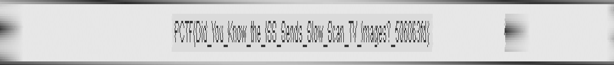

# terebeep (misc, 250pts)

>You might need to turn your volume up really loud if you want to hear [this](https://www.dropbox.com/s/p5lf53fphhurnu5/terebeep_8a72a79316aa7927aaed319049f9d56c.wav.xz?dl=0).
>
>Yow, okay, maybe that was too loud.

This is a wave file, if you know what [SSTV](https://en.wikipedia.org/wiki/Slow-scan_television) is - you immediately recognize it. Take any of SSTV decoders and see what you get:


It's easy! Let's zoom in and get the flag!


That's it!

Haha, I'm kidding. The author of the task is trolling us :)

Nevertheless, we have to go further. Let's see what we have: this is 16-bit 96kHz uncompressed wav file. Why? This is too much for SSTV, because SSTV is intended to transmit pictures via very narrow bandwidth (up to 2300Hz). Let's look at the spectrum:


Almost all the file has usual (narrow) bandwidth but something is obviously outstanding on the left, it uses all bandwidth up to 48kHz. It seems it wasn't a joke about zoom! Maybe the flag is encoded with very high resolution, let's try to get it.

Obviously, there is no such a decoder exist, we have to write it by ourselves. SSTV is well documented, [example](http://www.sstv-handbook.com/). Long story short, it uses FM modulation, 1200Hz for a sync pulse and 1500Hz-2300Hz for color intensity. The first thing we should do - demodulate FM signal. The easiest way is to use `GNU Radio`, like this:


Here we read the wav file, pass it to Hilbert transform. After that we have an "analytic representation" of the signal, that is, all samples are represented by complex numbers. It's easy to demodulate FM signal from this representation (just get an angle between two adjacent complex samples). The demodulation itself is done in "Quadrature Demod" block. Then the result is linear scaled and saved into another wav file. Let's see what it looks like:


Ok, now we need a decoder...

```python
from PIL import Image,ImageColor
 
thr=0x20      # threshold for sync pulse
pic_w=41109/3 # pic width [samples], one color
pic_h=300

w=open("tb_out.wav","rb").read()

i=Image.new("RGB", (pic_w,pic_h))
iw=i.size[0]
pix=i.load()

wi=0
ww=len(w)
y=0
while wi<ww:
  # skip sync
  while wi<ww and ord(w[wi]) <= thr+10:
    wi+=1

  # get pixels
  line=[]
  while wi<ww and ord(w[wi]) > thr-5:
    line.append(ord(w[wi]))
    wi+=1

  # draw pixels (only first color)
  for x,cc in enumerate(line[:pic_w]):
    clr=int( (cc-thr)/(255.0-thr)*255 ) # scale
    pix[x,y]=(clr,clr,clr)

  y+=1

# resize by Y
i=i.resize((pic_w, pic_h*4), Image.NEAREST)
i.save('tere.png')
```

Well, the picture is decoded but... This is what we get as a flag:


At least this is not a square with a few pixels:) We can recognize `PCTF` and even a part of the key (especially if you know that ISS sometime transmits SSTV): `Did you know the ISS sends slow scan TV images`. The rest of the key is unreadable... Also, you can see that image lines are moved and kinda blurred (moire). This is because Hilbert Transform works as a non-ideal filter.

I tried to resample the source signal but I couldn't get anything useful (maybe because it is clipped a little? "that was too loud"?). I dropped playing with GNU Radio.

Ok. If this signal is "ideal" (without noise, constant amplitude, etc.) we can try to demodulate it by some trivial way. FM modulated signal is described by a function like this: `A*cos(w*t+phi)`, where `w*t = 2*pi*Fc*t`, and `phi` is proportional to integral of a signal. So, a naive way is to calc arccos and get a derivative of the result.

Let's do it step by step. Find arccos:

```python
import struct,math
 
w=open("terebeep_8a72a79316aa7927aaed319049f9d56c.wav","rb").read()[200000*2:]
f=open("tb_arc.bin","wb")

# calc arccos of samples
ff=[]
pnts=[]
olddv=0

for x in xrange(2,len(w),2):
  # get prev and curr values
  oldv,v=struct.unpack("<hh",w[x-2:x+2])
  # calc delta
  dv=1 if v>oldv else -1

  # calc arccos
  a=math.acos((v+32768.0)/65535*2-1) #=0..pi
  # if dv>0 - second half of a period, so we'll get a=[0..2*pi)
  if dv>0:
    a=2*math.pi-a
  # store value [0..1)
  ff.append(a/math.pi/2)

  # if sign of delta was changed - store this point to fix value later
  if dv!=olddv:
    pnts.append((len(ff),dv))
    olddv=dv

# fix min/max points
ffz=[0]*len(ff) #debug

for x,dv in pnts:
  if dv>0:
    # we are rising (at pi, no wrap), just interpolate these points
    y0=ff[x-3]
    y1=ff[x]
    ff[x-2]=y0+(y1-y0)/3
    ff[x-1]=y0+(y1-y0)/3*2
  else:
    # we are wrapped down (at 2*pi), unwrap, interpolate, wrap
    y0=ff[x-3]
    y1=ff[x]+1
    avg1=y0+(y1-y0)/3
    if avg1>1:
      avg1=avg1-1
    avg2=y0+(y1-y0)/3*2
    if avg2>1:
      avg2=avg2-1
    ff[x-2]=avg1
    ff[x-1]=avg2
  # mark this point to debug purposes
  ffz[x-1]=1

# save arccos'd values
for i,a in zip(ffz,ff):
  #f.write(struct.pack("ff",a,i))  #debug
  f.write(struct.pack("f",a))

f.close()
```

After doing arccos we have a signal as wrapped ramp function `//////`. Also, you see here "fix min/max points" stuff. Again, this is because the signal was initially clipped, and upper and lower samples were corrupted. We fix these points with average arccos values (otherwise after differentiation we'll get significant spikes at these points).

Then we calculate a "derivative":

```python
import struct,math
 
w=open("tb_arc.bin","rb").read()
f=open("tb_darc.bin","wb")

# differentiate arccos values
for x in xrange(4,len(w),4):
  olda,a=struct.unpack("ff",w[x-4:x+4])
  d=a-olda
  # unwrap
  if d<0:
    d=1+d

  # scale to byte
  d=int( (d-0.011)/(0.025-0.011)*255 )
  d=max(0,min(255,d))
  # save
  f.write(struct.pack("B",d))

f.close()
```

Here we have 8-bit output which we can use with our previous decoder:

```python
from PIL import Image,ImageColor
 
thr=0x30
pic_w=41109/3
pic_h=300

w=open("tb_darc.bin","rb").read()[0:]

i=Image.new("RGB", (pic_w,pic_h))
iw=i.size[0]
pix=i.load()

wi=0
ww=len(w)
y=0
while wi<ww:
  # skip sync
  while wi<ww and ord(w[wi]) <= thr+10:
    wi+=1

  # get pixels
  line=[]
  while wi<ww and ord(w[wi]) > thr-5:
    line.append(ord(w[wi]))
    wi+=1

  # draw pixels (only first color)
  for x,cc in enumerate(line[:pic_w]):
    clr=int( (cc-thr)/(255.0-thr)*255 ) # scale
    pix[x,y]=(clr,clr,clr)

  y+=1

# resize by Y
i=i.resize((pic_w, pic_h*4), Image.NEAREST)
i.save('tere.png')
```

And we can see the result:



Flag: `PCTF{Did_You_Know_the_ISS_Sends_Slow_Scan_TV_Images?_506063fd}`

Almost ideal result :) Those gray dots is a consequence of our fixing points by average values.

