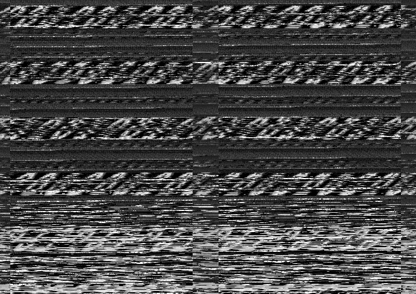

# [GNU Radio Challenge 21 Feb 2018](https://www.gnuradio.org/blog/gnu-radio-challenge-21-feb-2018/)

> At 1222 EST on 21 Feb 2018, we posted a new signals challenge! There are *three* different challenges hidden in this signal capture, and the solution to each is a text message. One is on the easier side, and two others are more advanced.

> Note: The SigMF meta file has a small error - fc32_le should read cf32_le.

> https://drive.google.com/file/d/1-bAdy_egdyb6xPA8rrvf32WgnDTSI29P/view?usp=sharing

We get a 1.3G data file named grchallenge-feb21-18.sigmf. I'm not a GNU Radio guy, so I don't know what a sigmf file is :) It turns out that this is a tar archive with two files:

* grchallenge-feb21-18.sigmf-meta
* grchallenge-feb21-18.sigmf-data

Meta-file is a description for data-file. So, from meta-file we know that data-file contains samples of 32-bit float numbers in the little-endian format. Sample rate is 1Msps. Apparently, this have to be IQ-data stream.

Just to quickly try to look what's in the file, I converted it to a 16-bit wav-file which can be fed to SDR#. Then I opened it.


After trying to set different modes and bandwidths, I found that WFM mode gives the best result (and yes, it looks like an FM station looks). And SDR# also shows RDS:

`NICEWRK  [ D193 ]  [ GNU Radio <3 ]`

Later it turned out that it is the key of the second challenge, wow :)

Well, at this moment we definitely know that we use a correct type of demodulation. The audio sounds similar to NOAA satellites or WEFAX (weather fax). I saved the demodulated audio and tried to feed it to NOAA decoder:



That's a fail. But we can see that it's definitely an image with some text there. Let's try WEFAX. I used Fldigi software. For LPM=240 and a bit tuning of slant correction I got this:


Much better! The picture still looks weird but we can see these 0s and 1s. Let's try to decode it.

```python
s=(""+
"01010111 01100101 00100000 01100110 01101001 "+  #W e   f i  +
"01101110 01100100 00100000 01101010 01101111 "+  #n d   j o  +
"01111001 00100000 01101001 01101110 00100000 "+  #y   i n    +
"01110100 01101000 01100101 00100000 01110011 "+  #t h e   s  +
"01101001 01101101 01110000 01101100 01100101 "+  #i m . . .  ?
"01110011 01110100 00100000 01110100 01101000 "+  #s t   t h  ?
"01101001 01101110 01100111 01110011 00101110")   #i n g s .  +

s=s.split(" ")
print "".join([chr(int(x,2)) for x in s])
```

Not all digits are visible, but they can be easily restored from the context.

The 1st challenge key is: `We find joy in the simplest things.`

One more challenge is left. There should be something more in the signal.

Basically, we have two options. There's something either in the original signal or in the modulated one. I tried the second option first and won :) Let's see the sonogram:


There are the audio spectrum itself (up to 15kHz), 19kHz carrier, no stereo signal at 38kHz and the RDS data at 57kHz. What's the thing at 92kHz? Looks like some modulated audio. Let's put already demodulated sound into SDR# and see if we can demodulate something.

Here I used GNU Radio (yeah!) to create IQ-data from a mono signal. I just used Hilbert transform.


In SDR# we tune at exact 92kHz frequency, set double side band (DSB) mode and listen... LOL, we just have been [RickRolled](https://www.youtube.com/watch?v=dQw4w9WgXcQ) :D Then the music stops and we hear a voice that spells something using [phonetic alphabet](https://en.wikipedia.org/wiki/NATO_phonetic_alphabet).


This is the message: Message 74 characters rot13avprjbexguvfvfgursvanypunyyratrqbfbzrguvatnjrfb..jvgutahenqvbrbyrot13

Ok, it says it's using rot13 encoding, let's decode:

```python
print "avprjbexguvfvfgursvanypunyyratrqbfbzrguvatnjrfb..jvgutahenqvbrby".decode("rot13")
```

And the flag obviously is: `niceworkthisisthefinalchallengedosomethingawesomewithgnuradioeol`

---

Nice work :) But there is not enough GNU Radio :) Let's do the same using the GNU Radio (well, except RDS, because I'm lazy).

Let's see what's in the original signal, what FFT and waterfall looks like.


Quadrature demod block is a FM demodulator. And the result:


And we can hear the signal. Looks like there is the only FM signal.

Let's see how the demodulated signal looks in time and frequency domains.


The result:


In waterfall we see four signals. The leftmost one is the audio signal (we can hear it), at 19k the FM carrier, at 57k the RDS data and at 92k some additional audio signal.

At the time domain we see that the low frequency audio signal is amplitude modulated (constant frequency and varied amplitude). That's why we saw weird image in WEFAX program, because faxes are frequency modulated.

Let's save the AM demodulated signal and decode the image:


Image decoder:

```python
from PIL import Image,ImageColor
import struct

pic_w,pic_h = 3125,700 # image size
thr1=-0.5 * 32768      # lower threshold
thr2=-0.43* 32768      # upper threshold
line_w = 3125.0        # line width (for slant correction)

f=open("am.wav","rb")
w=f.read(0x28) # hdr
w=f.read()     # data
w=struct.unpack("%dh"%(len(w)/2), w)

i=Image.new("RGB", (pic_w,pic_h))
pix=i.load()

wp=0  # data pointer
cx=0  # current x
cy=0  # current y
while wp<len(w):
  c=w[wp]
  cs=(c-thr1)/(thr2-thr1)*255.0  # scale
  cs=int(max(min(cs,255),0))     # limit 0..255
  pix[int(cx),cy]=(cs,cs,cs)

  wp+=1
  cx+=1
  if cx>=line_w:
    cx-=line_w
    cy+=1
    if cy>=pic_h:
      break

i.save('am.png')
```
The result:


Hey, WHAT??? This looks exactly like the NOAA images looked! Why couldn't my NOAA decoder decode the signal properly? Because it's a piece of s**t. It supports limited sample rates but doesn't have any checks for them. After resampling to required sample rate it shows following:


Ok. Now we need to decode the last 92kHz audio. This is the player:


Here we do the first FM demodulation (Quadrature demod), then convert real type signal into complex type (Hilbert). Our complex signal will occupy 0..Fsr/2 frequency range, while -Fsr/2..0 range will be suppressed. Although, it doesn't matter.

Then we need to shift 92kHz signal to 0Hz, we do this by multiplying the complex signal by a complex -92kHz cosine function. After that, we pass the signal through a low-pass filter, so only that needed signal is left.

Then we need to demodulate this signal. We can add some constant to it (to make it AM modulated instead of DSB) and then pass it through AM demodulator, but we can just take a real part of complex signal and that's all.

---

Well, I enjoyed the challenge, thanks to authors! :) Hope you've enjoyed the write-up.
